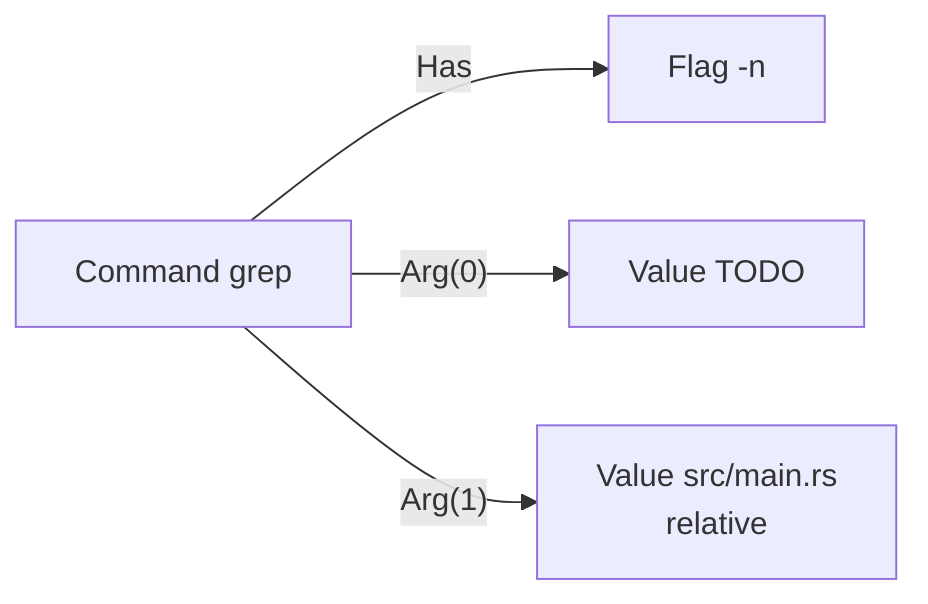
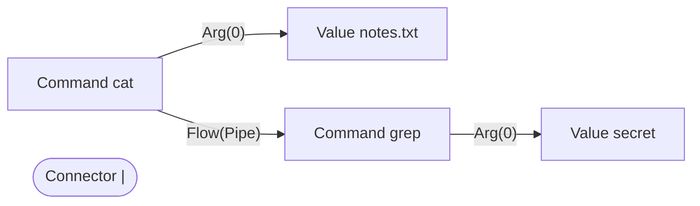
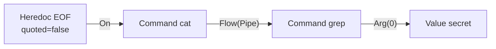
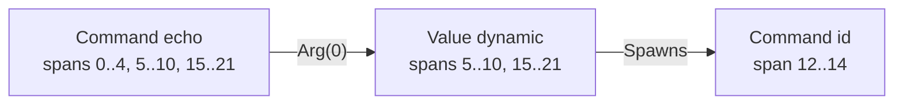

# The command graph

Design notes for the bash command IR — issue #13. This document lands with
sub-task 1 and is updated as later sub-tasks land.

Status: **sub-tasks 1, 2, 3, 5 and 6 complete.** The graph IR and emitter are
still mostly internal: `settings.jail_paths` is the one opt-in consumer, and the
default is unchanged. Sub-task 2 (heredoc re-parenting) is the one behaviour
change so far, and it landed in `bash.rs` as well as the graph because that is
where today's rules read structure; it closes #12.

Behaviour of the graph is pinned by `tests/graph_cases/*.toml` — a command and
what the graph should claim about it, as data. Read those first; they are the
executable half of this document.

## Why

`bash::Command` is a flat, context-free word list. Every consumer that needs
structure re-derives it from the CST, and each one rediscovers the same bugs:

| issue | what went wrong | root cause |
|---|---|---|
| #4 | `sed -n '/needle/p'` denied as a path escape | `looks_like_path` treats a leading `/` as proof of a filesystem path |
| #7 | `grep -n TODO x` rewrote to `rg TODO x` | rewrites were byte-span surgery over one contiguous range |
| #12 | `cat <<EOF \| grep secret` evades `piped_into` | the grammar nests the rest of the pipeline *inside* the heredoc |
| #11 | 13 hand-maintained program tables | all fragments of one question: what does this argument mean to this program? |

Each was patched where it surfaced. The shared cause is that structure is
recovered independently, over and over, by code that only sees words.

Lower the CST **once** into a typed graph. Rules query the graph.

## The inverted default

> **No map for a program → no reference edges → lictor says nothing about it.**

Today every `/`-leading word is assumed to be a filesystem path, and the four
layers of heuristic stacked on top of that assumption (`looks_like_path`, the
argument-role table, the locality table, the shape heuristic) exist to walk it
back. They are guesses correcting a wrong default.

The graph inverts it. A program with no argument map produces no `Reads` /
`Writes` / `Deletes` / `Creates` / `Execs` edges, so an unmapped command cannot
generate a false positive. The cost is silence on unmapped programs, which is
the honest failure direction: a parser can never be a security boundary, only a
lint.

The same rule applies *inside* a command. Stage 1 emits a `Takes` edge only when
the syntax settles the binding (`--color=auto`). Whether `-e` in `grep -e foo`
consumes the next word is a map question, so `foo` stays a plain positional
rather than a guess.

## The model

**Nodes** — `Command`, `Flag`, `Value`, `PathSet`, `Stream`, `Heredoc`,
`Connector`.

**Edges** — `Has`, `Takes`, `Arg(i)`, `Flow(connector)`, `Spawns`, `On`, and the
map-driven reference edges `Reads` / `Writes` / `Deletes` / `Creates` / `Execs` /
`Filters`.

### Nodes own a span *list*, not one range

This is the load-bearing detail, and it is not a generality for its own sake.
A word's text is genuinely discontiguous:

```
echo "pre $(id) post"
     └─────┘    └───┘   ← one Value node, two spans
           └──┘         ← belongs to the command `id`, not to the string
```

The `$(id)` bytes belong to another command entirely. If the string claimed
them, an edit to either would corrupt the other — which is the shape of the #7
bug, where a rewrite spliced text over a range it did not fully own.

Segments form a **partition**: every byte of the source belongs to at most one
node, and the gaps between owned segments (whitespace, quotes, keywords,
parentheses) are copied through untouched by the emitter. That is what makes an
edit surgical instead of byte-span surgery.

## Worked examples

All four are generated from the real lowering.

### `grep -n TODO src/main.rs`



The flag is a `Flag`, not argument zero. `rewrite` replaces the node holding
`grep` and nothing else — the #7 regression, stated structurally.

### `cat notes.txt | grep secret`



The connector is a node with its own span, so sub-task 10's `insert` can splice
a stage beside it (`cargo test | less` → `cargo test | tokf run -- | less`).

### `cat <<EOF | grep secret` — issue #12, fixed by re-parenting



tree-sitter nests the whole rest of the pipeline inside `heredoc_redirect`, so
the two ends of the pipe are **not siblings in the CST**:

```
redirected_statement
  command "cat"
  heredoc_redirect
    << / heredoc_start / pipeline("| grep secret") / heredoc_body / heredoc_end
```

Stage 1 lowered both commands faithfully but left them unrelated, which is
exactly what made every `piped_into` / `with` deny rule evadable by adding a
heredoc. Sub-task 2 lifts the nested `pipeline`/`list` to its logical position,
so the `Flow` edge above exists.

The same correction is applied in `bash.rs`'s `group_info`, which is where
today's rules actually read `group` / `position` / `group_len` / `connector`.
Doing it there rather than inside any one predicate is the point: **one fix
reaches every consumer**, and none of them can rediscover the bug
independently.

It also closed a second, opposite bug. A heredoc previously left its owner with
no enclosing group at all, so `cat` in `cat <<EOF | grep x` looked *standalone*
and a `position = "only"` rule wrongly fired on a pipeline.

### `echo "pre $(id) post"` — the discontiguous span list



The string word owns two disjoint stretches; the bytes between them belong to
`id`. The value is `dynamic`, so its text is `None` — per the existing
convention, a rule matching on an unknown value asks rather than guesses.

## Argument maps (sub-task 5)

`recipes/*.toml`, one file per program, embedded by `build.rs` and loaded by
`src/cmdmap.rs`. What each argument *means* to each program: which slots are paths, which flags consume the next word, and what the
program does to what it names.

```toml
[[cmd]]
name = "mv"
[[cmd.args]]
slots  = "except-last"
kind   = "path"
effect = ["read", "delete"]   # a set: mv's source is both
[[cmd.args]]
slots  = "last"
kind   = "path"
effect = ["write", "create"]
```

| field | values |
|---|---|
| `slots` | `all` · `first` · `last` · `except-last` · `rest` · `N+` (from slot N onward) · a number — counted **after** flag arguments are removed |
| `kind` | `none` · `path` · `pathset` · `cmd` · `host` / `container` (name the machine a payload runs on) · `glob` `regex` `code` `url` (accepted, consumed later) |
| `effect` | `read` · `write` · `delete` · `create` · `exec` — a set |
| `when` | `{ with = [...], without = [...] }` — guards an entry on the flags present |

Deliberately not Turing-complete: slots, kinds and effects, and nothing else.

**`takes` is why the maps exist.** Whether `-e` consumes the next word decides
every slot number after it. `grep -e PATTERN file` has *one* positional, not two,
and guessing from a leading dash is how `sed -n '/needle/p'` came to be denied.

**`when` is not decoration.** `grep PATTERN file` and `grep -e PATTERN file`
disagree about what slot 0 is. Without a guard, grep's map is wrong in one
direction or the other — either the pattern is read as a path (#4's false
positive) or a real file loses its read edge. This was found by building the map
without `when` first and watching `README.md` lose its edge.

**Wrappers reach their payload.** `sudo rm -rf x` applies rm's map to the words
after `sudo`, so the effects are rm's. Stage 1 could not say this at all, which
is the gap the P2 gate surfaced. Reference edges land on the outer command node,
because "what does this command line delete?" is the question rules ask.

### PathSets are populated from recipes

`kind = "pathset"` builds a [`globs::PathSet`] instead of pointing at the word.
`recursive_with` names the flags that turn one path into a tree; `recursive =
true` is for arguments that always descend.

    rm build        -> deletes build
    rm -rf build    -> deletes build/**
    find . -name x  -> reads ./**

`PathSetNode` wraps `globs::PathSet` rather than restating its four fields — the
same values declared twice is how the two drift.

### Locality is a fact of the word, not of the slot

`aws s3 cp`, `kubectl cp` and `scp` all put local and remote references in **one
positional list**:

    aws s3 cp ./build s3://bucket/path    slot 0 here, slot 1 elsewhere
    aws s3 cp s3://bucket/path ./build    the reverse
    scp host:/etc/hosts .                 the same shape, no scheme

The same slot is local in one spelling and remote in the other, so a recipe
field could not express it — which is why `graph::locality_of` reads it off the
argument instead. A location prefix is a `:` in a word that does not begin at a
filesystem root, and `RemoteRef::parse` splits it into scheme, authority and
path: `s3://prod-bucket/key` is a *key* in a *named bucket*.

**The reference edge still exists.** A reference edge says what the command does
to what it names; locality says where that thing is. The first version of this
dropped the edge, which said `aws s3 rm s3://bucket/key` deletes nothing — and
that is false. It deletes a key. Callers that mean *this* filesystem ask
`Graph::referenced_paths`, which is `Graph::references` filtered to local; the
full list is there for anything that grows to care about the other end.

Nothing configures remote references today. There is no `[[remote]]` rule
surface and this stage does not add one. Modelling them anyway is the difference
between a graph that cannot yet act on a fact and a graph that cannot ever
express it.

The `/`, `~` and `.` exemption is load-bearing in the other direction. A colon is
legal in a filename, and `/var/log/build:2024.log` has to stay local — losing it
would be a jail escape, which is the direction this codebase treats as dangerous.
Every word that can name something outside the current directory starts with one
of those three characters, so the exemption costs only the case in *Accepted
gaps* below. A remote word is also neither `absolute` nor `relative`: those facts
describe a path on this machine, and `s3://bucket/path` resolved against the cwd
is nonsense.

### A command runs somewhere too

`ssh host cat /etc/hosts` reads a file. Not here — but it reads one, and the
first answer to #4 was to say nothing at all, because there was nowhere to hang
the difference. There is now: a wrapper's payload is lowered as **its own
command node**.

    cmd[0] ssh          local
      reads ~/.ssh/id   local        (ssh's own flag)
      spawns cmd[1]
    cmd[1] cat          remote:host
      reads /etc/hosts  remote

Which makes three facts sayable that were not:

| | before | now |
|---|---|---|
| what runs | `sudo` deletes the file | `rm` deletes it, `sudo` execs `rm` |
| as whom | the `sudo` node was elevated | **`rm`** is elevated |
| where | nothing | `remote:host`, inherited by anything it spawns |

A recipe says a command runs elsewhere by naming a machine and a payload — an
arg with `kind = "host"` or `"container"`, and one with `kind = "cmd"`. Those two
statements together already mean the payload runs there, so there is no third
field, and no way to write a recipe where they disagree. `ssh`'s payload starts
at slot 1, which is what `slots = "1+"` is for: `rest` would take the hostname
itself as the program to run.

A reference is remote if **either** end says so. The two are independent:
`ssh host cat ./notes` is a local-looking word on a remote command, and
`aws s3 rm s3://b/k` is a remote word on a local one.

The minted node owns **no bytes**. The program word is already owned by the
`Value` it was lowered as, and two owners for one stretch of source is the
span-surgery bug (#7) by construction — an edit still addresses the `Value`,
which is how `tests/graph_cases/edits.toml` rewrites the inner program of
`sudo grep foo /var/log/x`. That was the "a rewrite cannot target the inner
program" gap this file used to list under *deferred*.

### A redirect is a reference

`echo hi > /etc/passwd` produced nothing (#29). The redirect was one opaque node
covering `> /etc/passwd`, so the file the shell truncates was not a node at all.
Now the destination is lowered as its own `Value`, bound to the stream with a
`Takes` edge, and `apply_redirects` turns it into `writes` + `creates`.

**This one needs no recipe**, which is not a hole in the inverted default. That
default exists because "what does this word mean to *this program*" is unknowable
without a map. `> file` is not a program's argument — it is shell syntax, and it
truncates that file whatever the program is. So an unmapped program can no longer
hide a write behind a redirect.

A here-string's word is data (`cmd <<< /etc/passwd` reads no such file) and a
descriptor dup names no file at all. Telling `2>&1` from `&>file` is done by
reading the **grammar** — a dup's destination is a `number`, not a word — because
both spell their operator `>&`.

Modelling it was only half of #29. The jail walks the *words* of each command and
asks the graph "is this one a path?", and a redirect target is not a word — so a
graph that knew about the write still could not surface it. Under
`jail_paths = graph` the paths now come from the graph itself, with the walk
supplying only its resolution machinery (cd tracking, `~` expansion). The
heuristic source has no path list of its own, so the default is untouched, and
`compare` will record the difference against real usage the way sub-task 8
intended.

### Nested subcommands

`subcommand` is a **path**, written space-separated: `subcommand = "s3 cp"`
matches `aws s3 cp`, and the deepest entry whose path prefixes the leading
positionals wins. It occupies that many slots, so every slot number is counted
after it.

The alternative was guessing a slot number. `aws s3 cp SRC DST` and `aws s3 rm
KEY` share `s3` and agree about nothing after it, so a single-level `s3` entry is
right for one form and wrong for the other — and being wrong here does not mean
saying nothing, it means pointing an effect at the wrong word.

Resolving a path rather than a word needs the leading positionals *before* the
map is chosen, which is why `leading_positionals` returns a run and stops at the
first dynamic word: a subcommand nobody can name puts every word after it at an
unknown depth.

### Known format gaps

**Global flags are resolved in two passes.** Finding the subcommand needs to know
which flags consume the next word, because `git -c core.pager=x rm f` puts the
flag's *argument* where the subcommand would be. Real audit data showed this
misfiring: `git core.pager='!id'` is one of the most frequent "subcommands" in a
123k-invocation corpus and is not a subcommand at all. The bare entry is resolved
first for its flags, and subcommand entries inherit them.

### What is deferred

The issue's format also lists `[cmd.kv]` (`dd if=/of=`) and richer slot binding.
Those are not implemented. `glob`, `regex`, `code`, `url`, `host` and `container`
parse and validate but produce no edges of their own. `host` and `container` do
have a job: naming the machine a payload command runs on. What `container` still
cannot reach is `kubectl exec pod -- cat /etc/config`, where the `--` separator
occupies a positional slot and shifts every number after it — see #24.

## PathSet and the glob∩glob matcher (sub-task 6)

`src/globs.rs`. Answers "can these two patterns both match the same path?", and
when they can, **produces one**.

The concrete path is the point. A deny requires a **witness**, not a claim of
overlap: intersection alone would fire `rm -rf .` against almost any rule anyone
would write, and a witness is also the thing you can show the person being told
no.

```rust
PathSet::under("build").witness_against("build/**/*.o")   // Some("build/a.o")
PathSet::under("build").witness_against("/etc/**")        // None -> no deny
```

`selects(S, P)`: under a root, matching every include, matching no exclude —
exclude wins, because that is what carving a hole means. No filesystem access
and no automata construction: a memoised recursion over the two token lists, the
product construction without building the product.

### The gate

`tests/glob_differential.rs`, with `globset` as the oracle. A witness is
**self-verifying** — globset can be asked directly whether both patterns match
it — so the positive half needs no reference implementation of intersection.

| check | scale |
|---|---|
| every witness matched by both patterns | 218 |
| known-intersecting pairs never called disjoint | 266 |
| the same, with patterns generated from each path | 727 |
| disjoint verdicts surviving a counterexample search | 358 |

A false **disjoint** is a missed deny; a false **intersects** is at worst a
spurious one. So most of the gate constructs pairs that are known to intersect
*by construction* — take a path, derive patterns that provably match it, insist
every pair finds a witness — rather than trusting a hand-written list of what
ought to overlap.

### Two things that would have made the gate lie

**globset's `*` crosses `/` by default.** `/etc/*` matches `/etc/a/b` unless
`literal_separator(true)` is set. Comparing against the default would have
disagreed everywhere for reasons unrelated to the code.
`the_oracle_uses_the_semantics_we_claim` pins it.

**A trailing `**` needs at least one segment.** globset matches `/etc/**`
against `/etc/a` but *not* against `/etc`, while `a/**/b` does match `a/b`.
Encoding that as "zero-or-more, then exactly one segment" at parse time keeps the
rule in one place. This was found by the gate, not by reading docs.

The pattern generator carries its own self-check, which caught a bug in the
generator itself (`/*.pem` for a single-segment path) before it could produce a
bogus assertion.

## Settled decisions

Carried from issue #13, unchanged.

| | decision |
|---|---|
| glob matching | segment-wise glob∩glob matcher (`*` no `/`, `**` crosses). No DFA product, no filesystem expansion. Merge gate: differential property test vs `globset` — a false "disjoint" is a missed deny and the only dangerous direction |
| deny criteria | requires a **witness**: a concrete path both the rule and the command's set select. Intersection alone is too weak (`grep -r x .` intersects almost everything) |
| filesystem access | **none**. Decidable iff at least one side is concrete. Pattern-vs-pattern (`**/*.pem` vs `cat /etc/ssh/*`) → **silent**, accepted and expected |
| dynamic words | any set containing one is `Unknown` → ask, per the existing `src/rules.rs:299` convention |
| round-trip | **P2** (`parse(emit(g′)) ≡ g′`, edit soundness) is the merge gate for edits. P1 (`emit(parse(s)) == s`) is free once the emitter copies untouched segments, and is kept as a diagnostic |
| heredocs | **supported**, not refused |
| map trust | **hand-written and reviewed only**. No provenance tiers. `--help` is a one-time seeding pass whose output is reviewed before it ships; it is never consulted at runtime |

## The P2 gate

`tests/graph_p2.rs`. `parse(emit(g'))` makes the same claims as `g'`: apply an
edit, emit, re-parse, and compare. Verified over **1,220 program-name rewrites**
and **619 argument rewrites** across the corpus.

This is the gate the issue requires *before* any rewrite feature exists. P1 says
the lowering is faithful when nothing changes; it says nothing about what happens
once you change something, which is the only case a rewrite cares about — and a
rewrite that emits text re-parsing into a different command is exactly the #7
bug.

Equivalence is `Graph::fingerprint`: the claims, with node ids and byte offsets
removed. An edit moves every span after it and a re-parse renumbers every node,
so comparing either would make the property trivially false while saying nothing
about soundness.

Two things the gate had to be built against, both of which caught something:

- **A no-op satisfies it.** A rewrite that changed nothing would round-trip
  perfectly, so `edits_must_actually_change_something` asserts the edit lands,
  the token appears, and the fingerprint moves.
- **It can silently test a narrow slice.** The first version keyed "is this
  command renameable?" off `Command::spans`, which is the union of the name *and*
  its arguments — so it only ever exercised argument-less commands. It reported
  701 checks and looked healthy. Keying off `Graph::owned_spans` (the segments a
  node actually owns, which is what an editor needs anyway) took it to 1,220.

It also pinned two facts about the model worth stating plainly:

- **Derived facts are recomputed, not carried.** Renaming `sudo` to a plain token
  de-escalates it — `privilege` follows the name, so the expected graph after an
  edit must recompute it.
- **Wrapped programs are not yet addressable.** In `sudo grep foo`, `sudo` *is*
  command[0] and `grep` is one of its arguments. Rewriting the inner program
  needs the `Execs` edge from sub-task 5. Worth knowing before `rewrite` moves
  onto the graph.

## The P1 gate

`tests/graph_p1.rs`. `emit(lower(s)) == s` over **1,373 string literals**
harvested from `tests/commands.rs`, `tests/redteam.rs` and `tests/exploits.rs`.

The corpus is harvested from the test sources rather than kept as a separate
list, so a command string added tomorrow is covered automatically.

P1 on its own is a weak gate in two ways, both closed explicitly:

- **It tolerates overlaps.** `emit` skips a segment starting before the cursor,
  so two nodes claiming the same bytes still round-trip. `overlapping_segments()`
  is asserted separately. This caught a real bug: `$(…)` inside a string or an
  unquoted heredoc body originally overlapped its parent.
- **It tolerates modelling nothing.** A lowering that owned no spans would round-
  trip perfectly. `coverage_is_not_vacuous` pins byte counts, and
  `every_command_name_in_the_cst_survives_lowering` checks the lowering against
  the grammar itself — every `command_name` tree-sitter recognises must come out
  as a `Command`.

That last check uses the CST as its oracle, deliberately **not** `bash::extract`.
The existing extractor also emits wrapper-stripped variants — `xargs git commit`
yields a synthetic `git commit`, driven by the `WRAPPERS` table at
`src/bash.rs:531`. The graph does not replicate that and should not: "this
program execs its argument" is a per-program map fact, and it becomes an `Execs`
edge in sub-task 5 rather than a second phantom command.

## What is still deferred

- **No `Extraction`/`Command` view over the graph** — sub-task 4. Every existing
  module still uses `bash::extract` untouched, and `jail.rs` re-parses the source
  to ask the graph anything.
- **Nothing consumes a remote reference.** The graph models them; no rule surface
  matches on them yet. Deliberate: a fact the graph cannot express is a rule that
  can never be written, while a fact nothing reads yet costs a struct field.
- **Compound constructs are not modelled semantically.** `if`, `for`, `while`,
  `case` and function bodies parse, and the commands inside them are lowered;
  the surrounding keywords fall through as unowned gaps. P1 holds regardless.

## Accepted gaps

Written down plainly, per sub-task 11. These are properties of the approach, not
defects to be fixed later:

- **Symlinked access paths.** The graph reasons about the path as written. A
  symlink pointing outside a jail is invisible to it.
- **Pattern-vs-pattern silence.** A rule glob against a command glob with no
  concrete side yields no witness, so no deny. Accepted and expected.
- **Dynamic paths.** `cat $TARGET` has no knowable value; it asks.
- **A relative name carrying a colon.** `cat notes:2024.txt` and `cat
  logs/build:1` are read as remote and produce nothing. The path is below the
  working directory, so it is inside the jail anyway; the alternative was
  claiming `s3://bucket/key` is a file on this disk.
- **Unenumerated secrets.** A rule can only protect paths someone named.

## Prior art

> **Not yet written.** This section is a placeholder for the issue author — a
> comparison against existing shell-analysis approaches was scoped in #13 but
> needs judgements about which prior work is genuinely comparable, which is the
> author's call rather than something to assert here.
